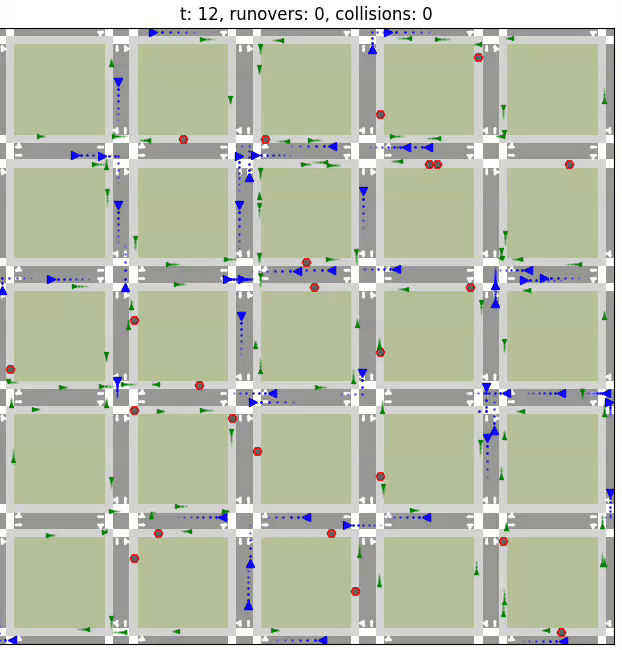

# Urban Mobility Simulation with Weighted A*

This repository contains a multi-agent urban mobility simulation for studying interactions between pedestrians and drivers on a grid-based city layout. The model combines weighted A* pathfinding, local sensing and reaction, and metric collection to analyze congestion, conflict zones, and mobility behavior under changing urban conditions.

The codebase is built around AgentPy and is currently organized as a research-style source tree, with the notebook serving as the clearest end-to-end walkthrough.

## Overview

The simulation models:

- Pedestrians and vehicles moving through the same city grid.
- Weighted A* routing that accounts for movement cost and behavioral risk.
- Local perception and reaction loops for agent decisions.
- Incident and movement metrics that can be aggregated into heatmaps.
- Experiment-style parameter variation for obstacle density and agent counts.

## Repository Layout

The main project code lives at the repository root:

- [UrbanSimulation.ipynb](./UrbanSimulation.ipynb): primary walkthrough for running and visualizing simulations.
- [main.py](./main.py): example seeded simulation setup for a single run.
- [Reporting.py](./Reporting.py): experiment-style script for parameter sweeps.
- [model/UrbanModelling.py](./model/UrbanModelling.py): `CityModel` orchestration, agent lifecycle, and metrics collection.
- [model/AgentBase.py](./model/AgentBase.py): base classes and shared agent behavior.
- [model/AgentImpl.py](./model/AgentImpl.py): concrete pedestrian and driver implementations.
- [utils/UrbanUtils.py](./utils/UrbanUtils.py): grid generation, obstacles, heuristics, and weighted A* utilities.
- [visual/AnimationUtils.py](./visual/AnimationUtils.py): visualization helpers.
- [images](./images): generated or referenced visual assets.



## Environment Setup

Recommended baseline environment:

- Python 3.9 or newer
- `agentpy`
- `numpy`
- `matplotlib`
- `jupyter` for notebook-based exploration

Example setup:

```powershell
python -m venv .venv
.\.venv\Scripts\Activate.ps1
python -m pip install --upgrade pip
python -m pip install agentpy numpy matplotlib jupyter
```

## How to Use the Project

### Notebook-first workflow

Start with [UrbanSimulation.ipynb](./UrbanSimulation.ipynb). It is the best entrypoint for understanding:

- city generation
- agent initialization
- seeded simulation runs
- animation and visualization
- experiment iteration

This is the recommended path if you want a reproducible walkthrough of the model and its outputs.

### Python scripts

The repository also includes script-based examples:

- [main.py](./main.py) shows how to configure a seeded city, generate obstacles and potholes, run `CityModel`, and produce heatmap-oriented outputs.
- [Reporting.py](./Reporting.py) shows how to build small experiment sweeps by varying parameters across multiple runs.

These files are useful references when moving notebook logic into reusable Python code.

## Model Concepts

Key implementation ideas in the current codebase:

- `CityModel` manages environment setup, spawning, simulation steps, and reporting.
- Agents follow a sense-react-choose-execute cycle.
- Weighted A* is used to generate routes through a city encoding that distinguishes roads, sidewalks, crossings, turns, parking, buildings, obstacles, and potholes.
- Metrics include arrivals, collisions, jaywalking-related behavior, average speed, and spatial heatmaps.

## Reproducibility Notes

The project already uses seeded randomness in its main simulation entrypoint. For comparable experiments and reporting runs, keep seeds explicit and keep parameter names aligned across notebooks and scripts.

## Current State

This repository is best treated as a simulation and analysis workspace rather than a packaged Python library. The notebook and source files document the intended workflow, while scripts serve as concrete examples for extending experiments and analysis.
